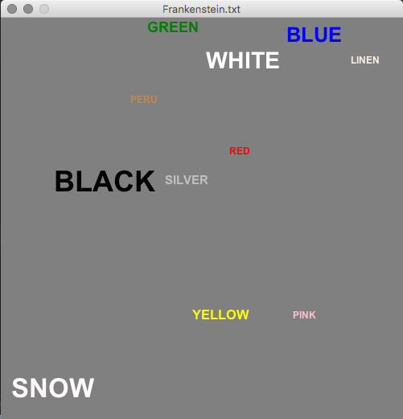

# CSC212P3
Counting Word Colors in Books! Import this in Eclipse early and often. Don't forget to Configure as Maven Project. Instructions are available on older assignments.



The learning objectives of this assignment are threefold:

1. Have some more open-ended Java practice! Revisit the video from Tuesday's lecture.
2. Practice using ``Map``s!
3. Do some Data Science.

***Due Date***: October 4, 2018.

Remember that we will have P4 opening on that day, so don't save it until the last minute!

# Rubric

## Reflection (=20)

As we will discuss in class, we will now be writing reflections for our programming assignments. This can be done in any software you like, provided you upload a PDF to moodle in addition to the zip file for the code.

Your reflection should identify any partners you worked with in Lab

I expect you to take notes as you do the assignment and turn in at least 10 bullet points for this reflection. They can be distributed across the two following categories as you wish.

### Lessons Learned

List things you learned or became more comfortable with with respect to data structures and Java. You may learn from the assignment directly, or perhaps from a particular Piazza post (even if it wasn't your question!)

### Challenges Remaining

List things that still challenge your understanding of data structures and Java.

## Program Compiles (=20)
This includes that your code should be professional. 
- Try to proofread your work like an essay! 
- Find all your ``println("stuff")`` statements and remove them, etc.
- Your code looks intentional: don't just fiddle with it until it works. Reason about it! Sketch out the python by hand and then try translating to Java.
- Delete commented out code or experiments that don't work out. Make your submission as small as it needs to be.
- Your code is your own. Respect the honor code.
- Working with others or helping them debug is acceptable - use your best judgment! Make sure that you know what you're working on.

## Commenting Code (only negative points here...)
 - Any methods or class-level variables left without a Javadoc comment (``/** */``) will result in the loss of a point.
 - Have comments explaining tricky code! (My video has my voice as a comment, so try to comment code you found tricky in it).

## Find a [Project Gutenberg](http://www.gutenberg.org/) book that you prefer to Frankenstein.
Make sure you get the UTF-8 Text version. Download it and put it in src/main/resources.

## Word Counting (=15)
 - Count up the words in your book.
 - Use my new WordSplitter class to help.
 - Resolve Eclipse's warning about not closing your file (if you follow the video code).
 - Use a try/catch statement for the errors and explain them to the user. (This means you should not change main!)

Basically, you will need a code block like this (demo'd in the video) inside of ``analyze(File book)``.
```java 
try {
  // File Opening and Reading Code
} catch (FileNotFoundException fnfe) {
  // Message to user.
  System.out.println(...);
  // Quit with any non-zero error code.
  System.exit(-2);
} catch (IOException ioe) {
  // Message to user.
  System.out.println(...);
  // Quit with any non-zero error code.
  System.exit(-1);
}
```

## HTML Named Colors (=15)
 - Take the HTMLColors class designed in class.
 - Remove the "extends GFX" (and all related code).
 - Modify the names to be lower-cased (to match our book).
 
## WordCloud code (colors) (=15)
 - Give WordCloud a public static instance of the HTMLColors class.
 - Use it to reimplement getColorByName(...)

## Hand only the color words over to the WordCloud code (=15)
 - Uncomment my code to make a viewer.
 - Make it work.
 
# Extra Sections 

The previous sections add up to 100. Do these sections only if you have an outstanding amount of free time, or if you are intrigued by the task. Unlike some of the other assignments, I won't be able to tell you exactly how hard they are, only that they're in reach, and it depends what you do.

The TAs do not have solutions to these challenges. They are vague because they're meant to be more research-oriented. The data in your book will lead you to the best questions.

## More books! (=8..?)
 - Analyze more books (e.g., all the works of Shakespeare) you can find, not just one.
 - To clarify, your code must accept a List<File> at some point. 
  - Don't just run your program over and over.

## More color words (=8..?)
 - Find the color-associated words in your book that are not matched by the HTML colors list. 
 - Add them to your dictionary yourself.

## Extra visualization (=10..?)
 - Find a better visualization for the data.
 - Make a bar plot in Excel (or Sheets, but harder to make the colors match).

## More science (=?)
 - Find the words next to color words.
 - What does that tell us about the colors.

## I love graphics & math (=20)
 - Make a BarChart in Java (class BarChart extends GFX)
 - ``fill(new Rectangle2D.Double(..))`` is your friend
 
